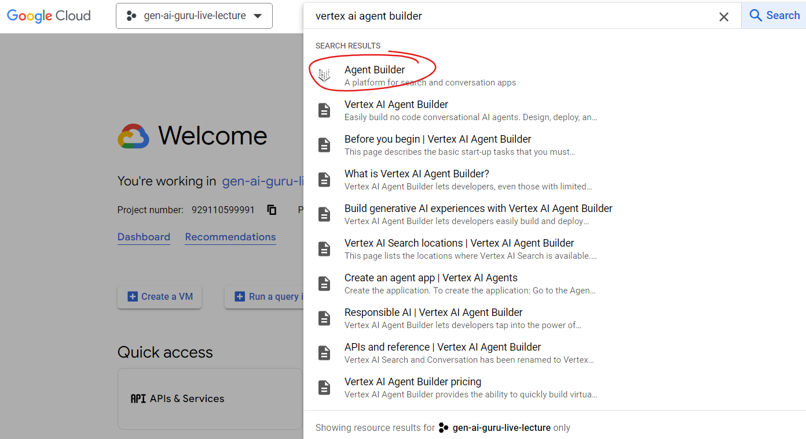
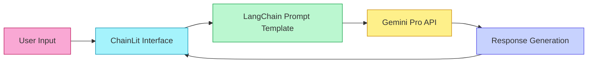

# 🌩️ Cloud Community Day 2024 Rajkot 🌩️

<div align="center">
  
  
  
  
  
  
</div>

## 📑 Table of Contents

- [📋 Event Overview](#-event-overview)
- [🌟 Showcased Projects](#-showcased-projects)
  - [🤖 Vertex AI Agent Builder](#-vertex-ai-agent-builder)
  - [💬 ChainLit UI with Gemini API](#-chainlit-ui-with-gemini-api)
  - [📄 ChatwithPDF RAG Demo](#-chatwithpdf-rag-demo)
- [🛠️ Technical Stack](#-technical-stack)
- [📝 Workshop Materials](#-workshop-materials)
- [🚀 Getting Started](#-getting-started)
- [👨‍💻 Presenter](#-presenter)

## 📋 Event Overview

This repository contains materials, demos, and code samples from the **Google Cloud Community Day 2024** event held in Rajkot, Gujarat, India. The workshop focused on building AI applications using Google Cloud's Generative AI tools, including Vertex AI Agent Builder, Gemini API, and RAG (Retrieval Augmented Generation) implementations.

<blockquote>
<p>🌟 <strong>Cloud Community Days</strong> are community-led events that showcase the latest in cloud technology innovations while bringing together developers, students, and professionals for a day of learning and networking.</p>
</blockquote>

## 🌟 Showcased Projects

### 🤖 Vertex AI Agent Builder

<div align="center">
  <table>
    <tr>
      <td colspan="2"></td>
    </tr>
  </table>
</div>

A demonstration of Google Cloud's **Vertex AI Agent Builder** to create an intelligent banking assistant called "BankBuddy". This demo showcases how to build conversational AI agents that can integrate with multiple tools and services.

#### 🎯 Key Features
- Banking and investment query assistance
- Integration with various tools:
  - Account Information
  - Investment Calculator
  - FAQ Database
  - ATM Locator
  - Branch Locator
- Multi-agent collaboration with loan specialists and investment advisors

#### 🔗 [Explore the Vertex AI Agent Builder Demo](Vertex%20AI%20Agent%20Builder/)

### 💬 ChainLit UI with Gemini API

A user-friendly chat interface built with **ChainLit** that integrates with Google's **Gemini API** for natural language understanding and generation.

#### 🎯 Key Features
- Elegant chat interface with real-time responses
- Integration with Gemini Pro LLM
- Custom persona as a knowledgeable historian
- Streaming responses for better user experience

<div align="center">



</div>

#### 🔗 [Explore the ChainLit UI Demo](Chainlit_UI_with_Gemini_API/)

### 📄 ChatwithPDF RAG Demo

A Streamlit application showcasing **Retrieval Augmented Generation (RAG)** to chat with PDF documents using Google's Gemini API.

#### 🎯 Key Features
- PDF document upload and processing
- Text chunking and vector embeddings using FAISS
- Context-aware responses from Gemini Pro
- Semantic search for relevant document sections

<div align="center">
  <table>
    <tr>
      <th>Component</th>
      <th>Description</th>
    </tr>
    <tr>
      <td>📄 PDF Processing</td>
      <td>Extract and process text from PDF documents</td>
    </tr>
    <tr>
      <td>🔍 Vector Search</td>
      <td>Create and query embeddings using FAISS</td>
    </tr>
    <tr>
      <td>🧠 Gemini Pro LLM</td>
      <td>Generate contextual responses based on document content</td>
    </tr>
    <tr>
      <td>🖥️ Streamlit Interface</td>
      <td>User-friendly web interface for document upload and querying</td>
    </tr>
  </table>
</div>

#### 🔗 [Explore the ChatwithPDF Demo](ChatwithPDF_RAGDemo/)

## 🛠️ Technical Stack

<div align="center">
  <table>
    <tr>
      <td align="center" width="200">
        
        <br>
        <strong>Vertex AI</strong>
      </td>
      <td align="center" width="200">
        
        <br>
        <strong>Gemini API</strong>
      </td>
      <td align="center" width="200">
        
        <br>
        <strong>LangChain</strong>
      </td>
    </tr>
    <tr>
      <td align="center">
        
        <br>
        <strong>ChainLit</strong>
      </td>
      <td align="center">
        
        <br>
        <strong>Streamlit</strong>
      </td>
      <td align="center">
        
        <br>
        <strong>FAISS</strong>
      </td>
    </tr>
  </table>
</div>

## 📝 Workshop Materials

The repository includes the following materials from the Cloud Community Day 2024 workshop:

- 📊 [Presentation Slides](_Cloud%20Community%20Days%202024%20_Yash%20Kavaiya%20(1).pdf)
- 💻 Code samples for all demonstrated projects
- 🧩 Configuration files and setup instructions

## 🚀 Getting Started

### Prerequisites

To work with the demos in this repository, you'll need:

- Google Cloud account
- Google Gemini API key
- Python 3.8+
- Git

### Installation Steps

1. **Clone the repository**

```bash
git clone https://github.com/Yash-Kavaiya/Cloud-Community-Day-2024-Rajkot.git
cd Cloud-Community-Day-2024-Rajkot
```

2. **Set up API credentials**

Create a `.env` file in the project root (and in each project directory):

```
GOOGLE_API_KEY=your_gemini_api_key_here
```

3. **Install project dependencies**

Each project has its own requirements file. For example:

```bash
# For ChainLit UI with Gemini API
cd Chainlit_UI_with_Gemini_API
pip install -r requirements.txt

# For ChatwithPDF RAG Demo
cd ../ChatwithPDF_RAGDemo
pip install -r requirement.txt
```

### Running the Demos

#### ChainLit UI with Gemini API

```bash
cd Chainlit_UI_with_Gemini_API
chainlit run app.py -w
```

#### ChatwithPDF RAG Demo

```bash
cd ChatwithPDF_RAGDemo
streamlit run app.py
```

## 👨‍💻 Presenter

<div align="center">
  
  <h3>Yash Kavaiya</h3>
  <p>AI/ML Engineer | Google Cloud Community Speaker</p>
  
  [](https://www.linkedin.com/in/yash-kavaiya/)
  [](https://github.com/Yash-Kavaiya)
</div>

---

<div align="center">
  <p>
    <strong>Made with ❤️ for the Cloud Community</strong><br>
    Thanks to all the attendees of Cloud Community Day 2024 Rajkot
  </p>
</div>
